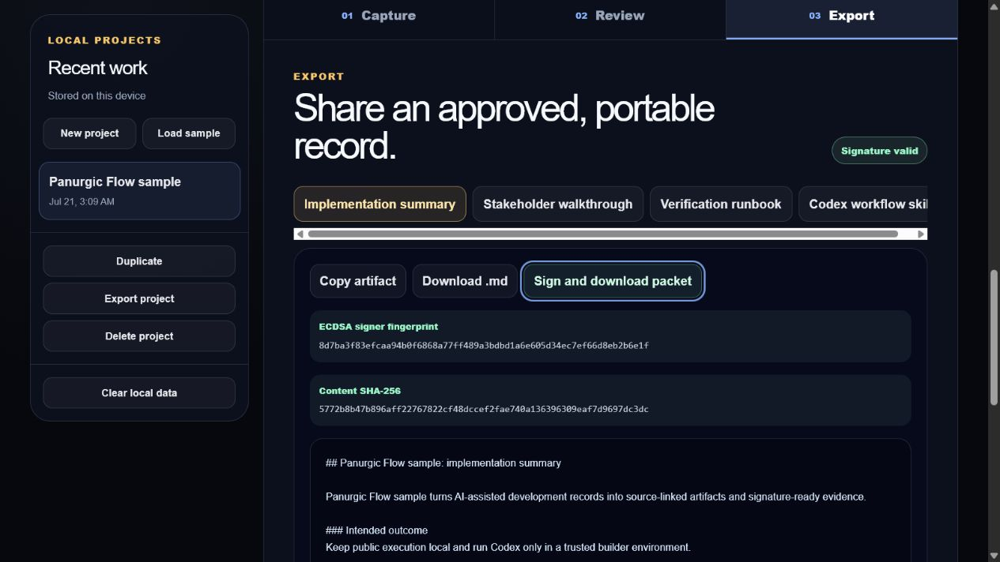

# Panurgic Flow

**Panurgic Flow is the signed release-evidence layer for AI-assisted software.** It turns completed multi-agent build records into source-linked claims, four reusable delivery artifacts, and cryptographically verifiable release packets.

- **Product:** [codex-flight-recorder.seemoreas0-0.chatgpt.site](https://codex-flight-recorder.seemoreas0-0.chatgpt.site)
- **Source:** [seemorecodez/panurgic-flow](https://github.com/seemorecodez/panurgic-flow)
- **Published demonstration:** [YouTube - Panurgic Flow (2:46)](https://www.youtube.com/watch?v=r3e1KMz23B0)
- **License:** MIT

## Its own category: signed release evidence

Most developer tools either control agents while they work or display activity afterward. Panurgic Flow begins at the missing release step. It converts completed work into a portable record whose claims remain source-linked, whose artifacts remain reusable, and whose packet integrity and signer-key continuity can be checked after transfer.

It proves packet bytes and key control without pretending that cryptography proves semantic truth. Human review, exact source evidence, an independently compared signer fingerprint, reproducible tests, and repository provenance remain separate and visible parts of the trust decision.



The screenshot is a real browser-local signed packet. Tampered signed packets are classified as `modified` by the same import path; adversarial digest, signature, and signer-fingerprint cases are covered by `tests/panurgic-core.test.mjs`.

## Product workflow

1. **Capture:** create a device-local project, paste prefixed repository and agent evidence, and preview recognized or unrecognized lines.
2. **Review:** build a deterministic packet, inspect its manifest, and trace generated claims to the strongest supplied sources.
3. **Export:** copy or download artifacts, sign the complete V1 packet with ECDSA P-256, and re-import it to verify both the signature and signer fingerprint.

The hosted product has no account, visitor analytics, API key, or model-generation endpoint. Up to 25 projects and ten recent packet versions per project are stored in IndexedDB on the current device. If persistent browser storage is unavailable, the product falls back to session memory and displays a warning.

## Architecture

Panurgic Flow deliberately separates its public and trusted execution paths:

- **Browser-local product:** evidence parsing, deterministic generation, claim mapping, project history, artifact export, SHA-256 checksums, ECDSA signing, and verification happen in the browser.
- **Trusted Codex companion:** an optional local CLI uses `@openai/codex-sdk` with `gpt-5.6-sol`. It runs with a read-only sandbox, no approvals, disabled network access, disabled web search, and strict structured output.

The public Cloudflare Worker adds a restrictive content security policy, frame denial, MIME sniffing protection, a no-referrer policy, and a permissions policy. `/api/generate` intentionally does not exist.

## Codex, GPT-5.6, and human decisions

Codex was the primary implementation partner for the product architecture, interface refactor, test design, accessibility checks, security hardening, documentation, and deployment preparation. Those contributions are inspectable in the repository and are verified by the commands in this README.

The optional trusted companion pins `gpt-5.6-sol` through `@openai/codex-sdk`. It converts a bounded forge request into structured `PanurgicPacketV1` output while using a read-only sandbox, denying approvals, and disabling network access and web search. The hosted website does not run this model or expose a credential.

The human entrant selected the product problem and Developer Tools audience, named Panurgic Flow, established the local/public trust boundary, chose the evidence and artifact model, and remains responsible for reviewing every final claim. A valid signature proves private-key control and unchanged packet bytes. It does not prove that the underlying evidence is true, and the displayed fingerprint identifies a person only when it is compared through an independent trusted channel.

### Recorded build effort

- **Recorded Codex execution:** at least **7.4 hours** across 32 completed turns in the primary task as of the July 21 pre-submission audit.
- **Elapsed build window:** **69.5 hours** from primary-task creation to that audit.
- **Measurement boundary:** human planning, review, recording, upload time, and the still-running final turn are not instrumented, so they are not fabricated or added to the active-hours figure.

## PanurgicPacketV1

Current exports use:

```json
{
  "kind": "panurgic-flow/evidence-packet",
  "schemaVersion": 1
}
```

The full contract contains project context, normalized evidence, provenance, the manifest, four artifacts, the claim ledger, timestamps, SHA-256 integrity metadata, and an optional ECDSA P-256 attestation. Imports are classified as `attested`, `checksum`, `unsigned`, or `modified` after checksum and signature verification.

The browser creates a device signing identity only when the user signs a packet. Its private key is imported as a non-extractable `CryptoKey` and stored in IndexedDB; only the public key and SHA-256 signer fingerprint are embedded in the packet. A checksum-only packet is never presented as signer verification.

Legacy unversioned Panurgic Flow packets remain importable. They are normalized to V1 in memory, including migration from `judgeRunbook` to `verificationRunbook`, without changing the original file.

## Installation

Prerequisites:

- Node.js 22.13 or newer
- pnpm 11
- Windows, macOS, or Linux
- an authenticated Codex session only for the optional model-assisted forge

```bash
pnpm install --frozen-lockfile
pnpm dev
```

Use the local URL printed by the development server. No environment file or API key is required.

## Codex forge

Validate the bundled request without starting Codex:

```bash
pnpm codex:forge -- --validate examples/forge-input.json
pnpm codex:forge:dry
```

Run the authenticated forge:

```bash
codex login
pnpm codex:forge -- examples/forge-input.json
```

The default output is `outputs/panurgic-codex-packet.json`. The CLI refuses to overwrite existing output and restricts writes to JSON files inside the workspace. Use `pnpm codex:forge -- --help` for all options.

## Verification

```bash
pnpm lint
pnpm test
pnpm proof:validate
```

The suite covers parsing, deterministic generation, V1 validation, legacy migration, canonicalization, checksum/signature separation, valid and adversarial ECDSA verification, non-extractable key persistence, bounded project/version storage, secure CLI behavior, public routes, security headers, accessibility structure, bundle size, and removal of the hosted generation route.

## Cryptographic release provenance

`proof/panurgic-flow-release-claims.json` is the machine-readable public claim set. `.github/workflows/release-trust.yml` performs locked installation, dry forge validation, lint, tests, production build, secret scanning, and claim-contract validation before `actions/attest` attaches GitHub OIDC and Sigstore provenance to that exact file.

After the public workflow succeeds, independently verify repository identity, workflow identity, commit provenance, and the artifact digest with:

```bash
gh attestation verify proof/panurgic-flow-release-claims.json --repo seemorecodez/panurgic-flow
```

The attestation proves artifact provenance; the public source, tests, workflow, signer fingerprint, and stated limitations remain the evidence for deciding whether to trust each semantic claim.

After deployment, run the signed-out production smoke test:

```bash
pnpm test:smoke
```

Release budgets are enforced at less than 125 KB gzip for combined client JavaScript/CSS and less than 350 KB for the single social card.

## Privacy and data handling

- No project evidence is uploaded by the hosted application.
- No visitor analytics or advertising trackers are present.
- Browser history is device-local and can be cleared from the product.
- Exports occur only after an explicit user action.
- Diagnostic downloads exclude project evidence and error stacks.

Read the live [privacy](https://codex-flight-recorder.seemoreas0-0.chatgpt.site/privacy), [security](https://codex-flight-recorder.seemoreas0-0.chatgpt.site/security), and [documentation](https://codex-flight-recorder.seemoreas0-0.chatgpt.site/docs) pages for the public product contract.

## Repository guide

```text
app/                         public product, routes, and error boundaries
lib/panurgic-contract.mjs    shared V1 contract, migration, checksum, signing, verification
lib/panurgic-core.mjs        deterministic evidence parser and artifact generator
lib/panurgic-storage.mjs     bounded IndexedDB storage with memory fallback
scripts/panurgic-forge.mjs   secure local Codex companion
tests/                       domain, storage, route, security, and release checks
proof/                       machine-readable public release claims
.github/workflows/           locked verification and GitHub/Sigstore attestation
docs/submission/             time-bound submission documentation and research
```

## License

Copyright (c) 2026 seemorecodez. Released under the [MIT License](LICENSE).
